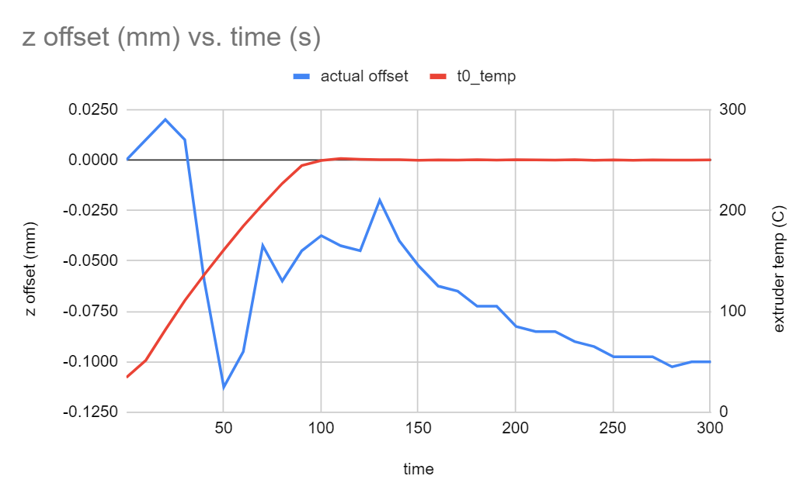

# Stable Z Homing for Klipper

### A Klipper plugin for accurate Z homing

This plugin provides a new G-code command, `STABLE_Z_HOME`, which homes Z
repeatedly until the Z offset stabilizes. This is useful if you have a
printer which homes by pushing the nozzle against the Z endstop,
where any plastic on or oozing from the nozzle can affect the Z offset
and hence cause variation in the height of your first layer.
The plugin can optionally run a G-code script before each probe, allowing you
to clean the nozzle immediately before the offset is measured.

#### Feed the Llama

This plugin is developed in my spare time. If you like it, please
consider supporting further development and updates by making a donation.

[](https://www.paypal.com/donate?business=HPGUMVJFSCXZ4&no_recurring=0&currency_code=USD)

---

### Motivation

To illustrate the problem this plugin is designed to solve, here is an experiment
run on a Voron V2.4, with the nozzle pushed against a pin connected to
a microswitch used as the Z endstop. I measured the probed Z offset every 10 seconds,
starting with the extruder cold, and heating the extruder to the printing temperature
for ABS (250C here). The nozzle was not scrubbed or cleaned in any way before
or during this run, for demonstration purposes.

You can see that the Z offset varies by as much as 0.15mm during the run.
As the plastic on the nozzle melts and gets squashed, the nozzle appears to move
0.15mm closer to the bed. Then, the filament in the nozzle oozes, pushing the nozzle
up by 0.10mm over the next minute. Finally, as the oozing subsides, the offset
settles at around -0.10mm.



### Installation

Clone the repo into the home directory of your Pi, then symlink `stable_z_home.py`
into your Klipper installation, like this:

```
$ cd ~/klipper/klippy/extras
$ ln -s ~/Klipper-Stable-Z-Home/stable_z_home.py .
```

Add the following to your Klipper config file, adjusting the G-code, which will be
run before each probe attempt, to your needs:

```
[stable_z_home]
gcode:
    # use nozzle brush to clean nozzle; requires PURGE parameter, see below
    CLEAN_NOZZLE PURGE=0  
```

You can then add `STABLE_Z_HOME` to your `PRINT_START` macro, to replace the
final `G28 Z` you may have there. A good time to do this is between heating
the extruder and your final purge, e.g.:

```
[gcode_macro PRINT_START]
gcode:
    # ...
    M104 S{EXTRUDER}
    M109 S{EXTRUDER}

    STABLE_Z_HOME  # instead of G28 Z

    CLEAN_NOZZLE PURGE=1
    # ...
```

Note that to use the `CLEAN_NOZZLE` macro, which is from edwardyeeks' excellent
purge bucket and nozzle scrub macros which can be found
[here](https://github.com/VoronDesign/VoronUsers/tree/master/printer_mods/edwardyeeks/Decontaminator_Purge_Bucket_%26_Nozzle_Scrubber),
you need to extend the macro with a `PURGE` argument which allows you to scrub
the nozzle without purging. Skipping the purge before each probe attempt saves
time and minimizes oozing. The macro is easily extended like this:

```
[gcode_macro clean_nozzle]
# Add a parameter at the top, with default value 1 (purge).
default_parameter_PURGE: 1

# ...

gcode:
      # ...

      # Replace the "if" condition around the purge section in the macro as follows.

      ## Check if user enabled purge option or not.
      
      
        # ... perform the purge ...
      
      
      
      # ...
```

### Configuration

The following parameters can be adjusted in the `[stable_z_home]` section:

```
[stable_z_home]
#gcode:
#  The G-code to run before each probe attempt. The default is none.
#retries:
#  The maximum number of probe attempts allowed. The default is 20.
#window:
#  The number of samples to use in the tolerance window. The default is 4.
#retry_tolerance:
#  The maximum range between the min and max values of the Z offset in the window
#  to consider the offset stable and complete the procedure. The default is
#  0.0025mm.
```

The parameters `RETRIES`, `RETRY_TOLERANCE`, and `WINDOW`, can also be passed
to the `STABLE_Z_HOME` command, in which case they override the defaults set
in the config section above.

---

*Copyright (C) 2021 Matthew Lloyd*
